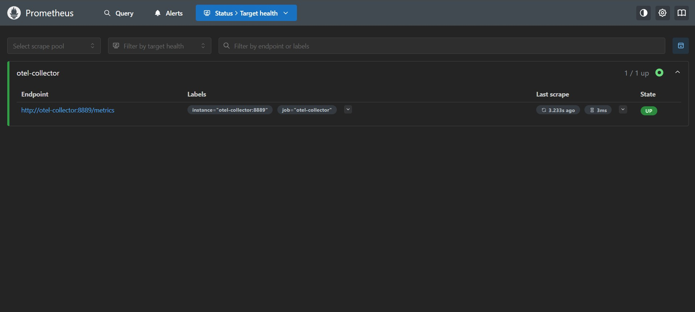
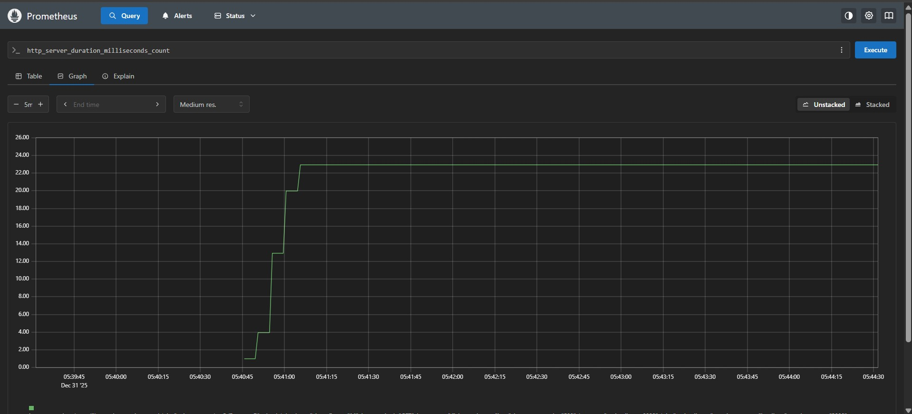
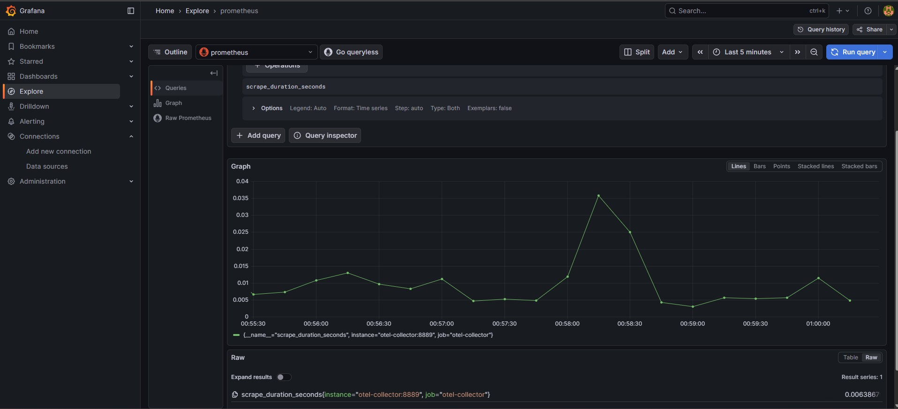
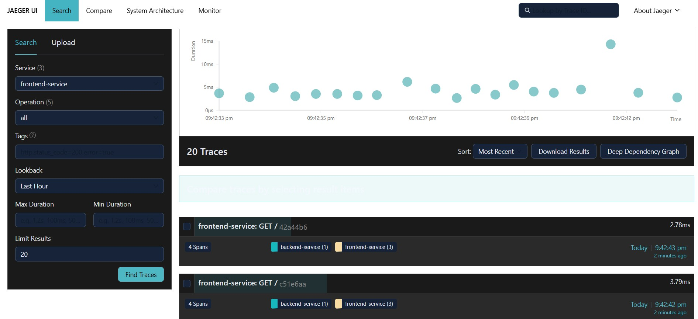
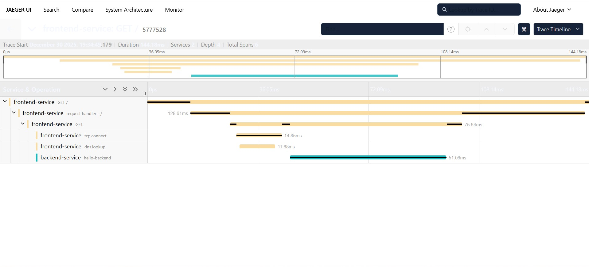
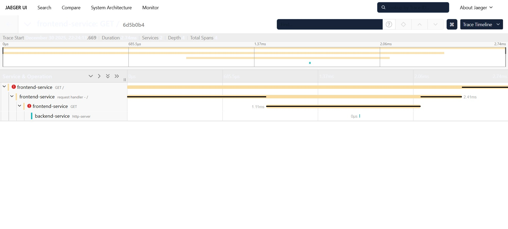

# Distributed Observability Mesh

[]() []() []()

A polyglot reference architecture demonstrating distributed context propagation and telemetry pipeline orchestration using OpenTelemetry. This repository is a proof-of-concept for decoupling telemetry collection from storage backends and showing best-practice patterns for trace and metric propagation across heterogeneous services.

Why this repo?
- Demonstrates cross-language trace parenting (Node.js -> Go) using W3C trace context.
- Shows a centralized, transformable telemetry gateway (OTel Collector) that reduces service complexity.
- Provides reproducible example for Jaeger, Prometheus and Grafana integration.

Table of Contents
- Quickstart
- Architecture (visual)
- Components & Design Patterns
- Deployment & Orchestration
- Verification & Semantic Checks
- Development / Contributing
- License & Contact

Quickstart (3 steps)
1. Start the observability stack:
```bash
docker-compose up -d
```

2. Start the Go backend:
```bash
cd services/backend
go mod tidy
go run main.go
```

3. Start the Node.js frontend (with auto-instrumentation):
```bash
cd services/frontend
npm install
node --require ./instrumentation.js app.js
```

Architecture:

A polyglot reference architecture demonstrating distributed context propagation and telemetry pipeline orchestration using OpenTelemetry. This repository is a proof-of-concept for decoupling telemetry collection from storage backends and showing best-practice patterns for trace and metric propagation across heterogeneous services.

<p align="center">
  
  <br>
  <em>System Architecture: Distributed Context Propagation Flow</em>
</p>

- The flow: frontend (Node) -> backend (Go) -> OTel Collector -> exporters (Jaeger, Prometheus, others)

Components & Design Patterns
- OTel Collector (Gateway Aggregation)
  - Role: Unified telemetry pipeline and transformation point.
  - Protocol: OTLP/gRPC (port 4317) — benefits include HTTP/2 multiplexing and compact Protobuf payloads.
  - Rationale: Keeps exporters and cardinality-control out of application services.

- Instrumented Ingress Layer (Node.js / Express)
  - Role: Root span producer (CLIENT).
  - Implementation: Auto-instrumentation using NodeSDK; loaded with `--require ./instrumentation.js`.
  - Details: Monkey-patches native http/https to propagate W3C trace context and create root spans.

- High-Concurrency Business Logic (Go / Gin)
  - Role: Leaf span and metric provider (SERVER).
  - Implementation: Uses a TextMapCarrier for extracting context from headers so Go spans become children of Node.js spans.
  - Rationale: Go provides efficient concurrency and compiled binaries for high-throughput services.

Deployment & Orchestration
Stage 1 — Provision the infra:
```bash
docker-compose up -d
```
- Brings up the OTel Collector, Jaeger, Prometheus, and Grafana (when configured).
- The Collector is isolated so observability failures do not cascade to application logic.

Stage 2 — Run Go service:
```bash
cd services/backend
go run main.go
```
- Initializes an OTLP-gRPC exporter; emits counters and histograms.

Stage 3 — Run Node service (pre-init instrumentation):
```bash
cd services/frontend
node --require ./instrumentation.js app.js
```
- instrumentation.js initializes a BatchSpanProcessor (batching preferred for throughput).

Verification & Semantic Analysis
1. Distributed Trace Integrity (Jaeger)
- Open Jaeger UI and search for traces from `frontend-service`.
- Confirm Trace ID remains the same across Node -> Go boundary.
- Verify span.kind: Node span = CLIENT, Go span = SERVER (synchronous RPC relationship).

2. Metrics & Cardinality (Prometheus / Grafana)
- Metrics follow OTel semantic conventions (e.g., `http.server.duration`).
- Prefer transformations in the Collector to drop high-cardinality labels before exposure to Prometheus.
- Check for expected histogram buckets and cumulative monotonic counters.

Commands / Useful URLs
- Jaeger UI (example): http://localhost:16686
- Prometheus (example): http://localhost:9090
- Grafana (example): http://localhost:3000

Files of interest
- services/frontend/instrumentation.js — Node auto-instrumentation bootstrap
- services/backend/main.go — Go service and OTLP exporter
- collector-config.yaml — Collector pipelines & exporters
- docker-compose.yml — Local multi-service composition

Visuals & Assets
- **Architecture Diagram:**
- **Metrics & Scrapping (Prometheus):**
  
  
  

- **Distributed Tracing (Jaeger):**
  
  
  

Development / Contributing
- Please open issues for feature requests or bugs.
- PRs should include:
  - Clear description of change
  - Test and/or validation steps
  - If adding visual assets, place them under `docs/assets/` and reference from the README


Contact
- Maintainer: KrishnaKondra18
- Repo: https://github.com/KrishnaKondra18/distributed-observability-mesh
